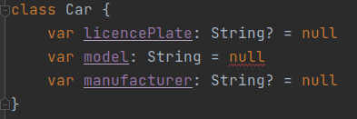

== Nullsafety

----
Null can not be a value of a non-null type String
----

== Nullsafety

Das null-safe Antipattern +

[source, java]
----
include::src/main/java/nullsafe/CarValidator.java[]
----

== How to solve in kotlin
[source, java]
----
include::src/main/java/nullsafe/CarValidator_kotlin.kt[]
----

[%step]
* well ...

== How to solve in kotlin
[source, java]
----
include::src/main/java/nullsafe/CarValidator_kotlin2.kt[]
----

[%step]
* Besser!

== How to solve in kotlin
[source, java]
----
include::src/main/java/nullsafe/CarValidator_kotlin3.kt[]
----

[%step]
* Noch besser!

== How to solve in kotlin
[source, java]
----
include::src/main/java/nullsafe/CarValidator_kotlin4.kt[]
----

[%step]
* Ich will aber!
* Hier kann eine NullpointerException fliegen!

== "Das Übel an der Wurzel packen"
[source, java]
----
include::src/main/java/nullsafe/Car.kt[]
----
[%step]
* Fachlich vielleicht nicht gewünscht